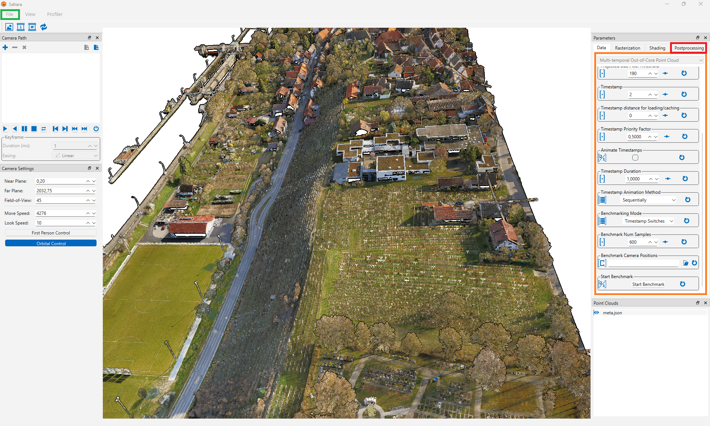

# README 
This branch contains the version of the Sahara Point Cloud Renderer used for evaluating the rendering approach presented in our paper:

**Out-of-Core Rendering of Multi-Temporal Point Clouds**, Wegen et al., 2026.

For the most recent version of the renderer, please use the [`main`](../../tree/main) branch.
It omits several paper-specific features, such as benchmarking functionality, and reflects the current state of development. 

## Setup Instructions
To setup the renderer, follow these steps:

1. **Install dependencies**
    - [CMake](https://cmake.org) (minimum version 3.16; 4.x version probably won't work)
    - [Qt](https://www.qt.io/download-dev) (minimum version 6.7).

2. **Build the project using CMake**
    - On Windows and Linux systems, you can use the respective build script:
        - For Windows, create a `configure.bat` file by copying `configure_template.bat` and fill in the correct values. Then run `build.bat build`.
        - For Linux, create a `configure.sh` file by copying `configure_template.sh` and fill in the correct values. Then run `build.sh build`.
    - To enable profiling, `PROFILER_ENABLED=ON` has to be set in the `configure` script. If the OS file cache should be bypassed to avoid caching effects for consecutive measurements `BYPASS_OS_FILE_CACHE=ON` has to be set. Both options activate corresponding preprocessor defines.

3. **Run the application**
    - Either launch from within your IDE
    - Or build the INSTALL target to create a folder containing the executable along with all required dependencies


## Reproducing the Experiments
The point clouds used in the evaluation, already converted to our out-of-core format, are available at: [https://storage-share.pointcloudtechnology.com/s/9pyXNWAKpk7yF22](https://storage-share.pointcloudtechnology.com/s/9pyXNWAKpk7yF22) (password: 7spj87kxa6).
For the Noordwijk dataset, the *point.bin* is split into multiple .tar archives (due to its large size) and must be extracted before use.


_Screenshot of the renderer_

### Reproducing the Experiments for Temporal Exploration
1. **Load point cloud and set parameters**
    - Open a point cloud via the _File_ menu (highlighted in green in the screenshot).
    - Set the correct parameter values in the parameter panel (highlighted in orange)
        - *Projected Size Pixel Threshold*: 250 for Hessigheim, 150 for the others
        - *Benchmarking Mode*: Timestamp Switches
        - *Benchmark Num Samples*: 600
        - *Timestamp Duration*: Depends on the point cloud and storage device. For point clouds with larger timestamps and for slow storage devices, higher values should be selected. We used values between 0.5s and 8s. The goal is to provide enough time for loading all chunks selected for rendering, in order to be able to measure the time-to-frame-completion.
    - Select the correct *Benchmark Camera Positions* for the dataset. The camera paths used in our evaluation are located in the `camera_paths/temporal_experiments` folder.
    - Add the hole-filling postprocessing step via the + icon in the postprocessing tab (highlighted in red).

2. **Start Measurements**
    - Start playback and profiling with the *Start Benchmark* button.
    - The results are written to a "benchmark_results" folder in the project root.

3. **Postprocess Results**
    
    After all parameter configurations had been benchmarked, we aggregated the results of all measurements using the Python script `scripts/convert_temporal_measurements.py`. The script expects the following folder structure:
    ```
    measurements
    |-- storage_device_1
        |-- dataset_1
            |-- benchmark_0
            |-- benchmark_5
            |-- benchmark_6
            |-- ...
        |-- dataset_2
        |-- ...
    |-- storage_device_2
    |-- ...
    ```
    For some metrics, the script only writes a CSV with accumulated numbers that we later used to create the charts in the paper (using TikZ/PGFPlots), for others it precomputes TikZ code for performance reasons.

### Reproducing the Experiments for Spatial Exploration
1. **Load point cloud and set parameters**
    - Open a point cloud via the _File_ menu (highlighted in green in the screenshot).
    - Set the correct parameter values in the parameter panel (highlighted in orange)
        - *Projected Size Pixel Threshold*: 250 for Hessigheim, 150 for the others
        - *Benchmarking Mode*: Camera Animation
        - *Benchmark Num Samples*: 100
    - Select the correct *Benchmark Camera Positions* for the dataset . The camera paths used in our evaluation are located in the `camera_paths/spatial_experiments` folder.
    - Add the hole-filling postprocessing step via the + icon in the postprocessing tab (highlighted in red).

2. **Start Measurements**
    - Start playback and profiling with the *Start Benchmark* button.
    - The results are written to a "benchmark_results" folder in the project root.

3. **Postprocess Results**

    After all parameter configurations had been benchmarked, we aggregated the results of all measurements using the Python script `scripts/convert_spatial_measurements.py` (requires matplotlib and numpy). The script expects the same folder structure as the one for the temporal experiments. For some measurements, the script directly creates charts, for others it only writes a CSV with accumulated numbers that we later used for our analysis or to create the charts in the paper.


## Known Issues
### Wayland on Fedora
When running under Wayland on Fedora, a bug may cause the framebuffer to be created without a valid extent. As a workaround, force Qt to use the X11 backend instead by setting the enviroment variable `QT_QPA_PLATFORM=xcb`.
### oneTBB and Qt Conflicting
Sahara uses the `<execution>` header in some places for parallel processing. In the GNU libstdc++, these algorithms are implemented using oneTBB ([https://github.com/gcc-mirror/gcc/blob/8be0893fd98c9a89bbcd81e0ff8ebae60841d062/libstdc%2B%2B-v3/include/bits/c%2B%2Bconfig#L948](https://github.com/gcc-mirror/gcc/blob/8be0893fd98c9a89bbcd81e0ff8ebae60841d062/libstdc%2B%2B-v3/include/bits/c%2B%2Bconfig#L948)). 
However, oneTBB conflicts with QT due to name collisions (e.g., with respect to the `emit` keyword: [https://github.com/uxlfoundation/oneTBB/issues/547](https://github.com/uxlfoundation/oneTBB/issues/547)), leading to compiler errors when both are used together.
If both oneTBB and libstdc++ with parallel algorithm support are present on your system, there are two options for building Sahara:

1. **Disable Qt keyword macros**
   Define `QT_NO_KEYWORDS` and replace all Qt-specific macros (`emit`, `signals`, `slots`) with their explicit equivalents (`Q_EMIT`, `Q_SIGNALS`, `Q_SLOTS`).
   This approach preserves full support for parallel algorithms.

2. **Disable the TBB parallel backend locally**
   Define `_GLIBCXX_USE_TBB_PAR_BACKEND` in the affected compilations units to prevent libstdc++ from using oneTBB.
   Note that this disables parallel algorithm execution in those compilation units.


## Citation
```
@inproceedings{wegen2026,
    author = {Wegen, Ole and Steeger, Sandro and Scheibel, Willy and  Richter, Rico and Döllner, Jürgen},
    title = {Out-of-Core Rendering of Multi-Temporal Point Clouds},
    booktitle = {Proceedings of the 26th Eurographics Symposium on Parallel Graphics and Visualization (EGPGV)},
    year = {2026},
    doi = {10.2312/egpgv.20261002}
}
```

## Acknowledgements
This renderer was primarily developed by Ole Wegen. Special thanks go to Matthias Trapp for his work on the initial version of the renderer, from which several UI components and the icon design were retained; to Sandro Steeger and Andreas Franke for Linux-specific fixes; and to Jorge Ciprián-Sánchez for his contributions to PLY loading functionality.


## License
This project is licensed under the MIT License (see the LICENSE.md file). Portions of this project incorporate [tinyply](https://github.com/ddiakopoulos/tinyply), which is released into the public domain (with fallback licensing as described in its source).
